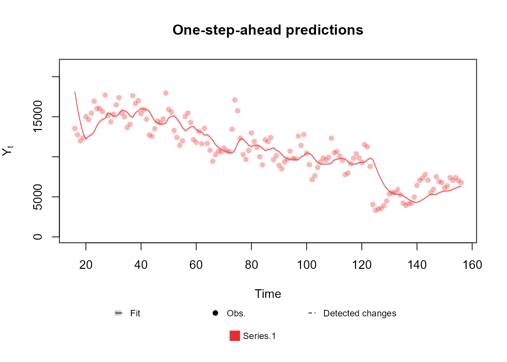
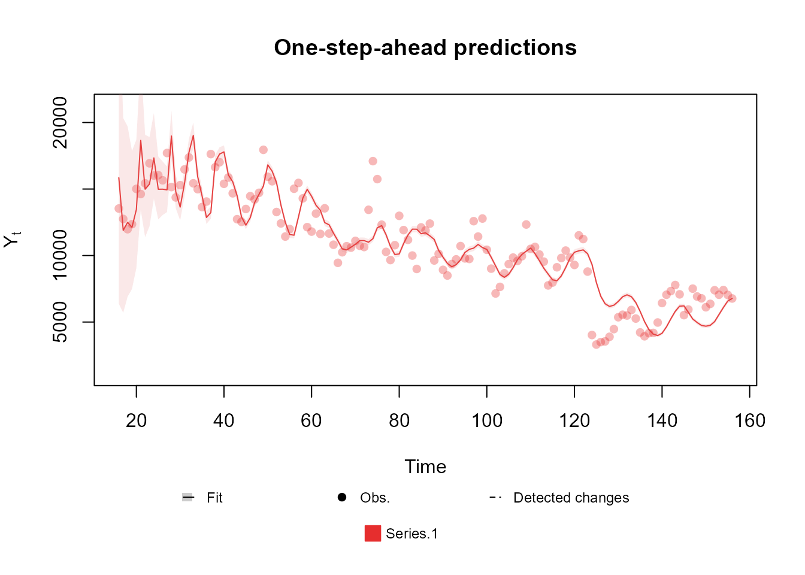
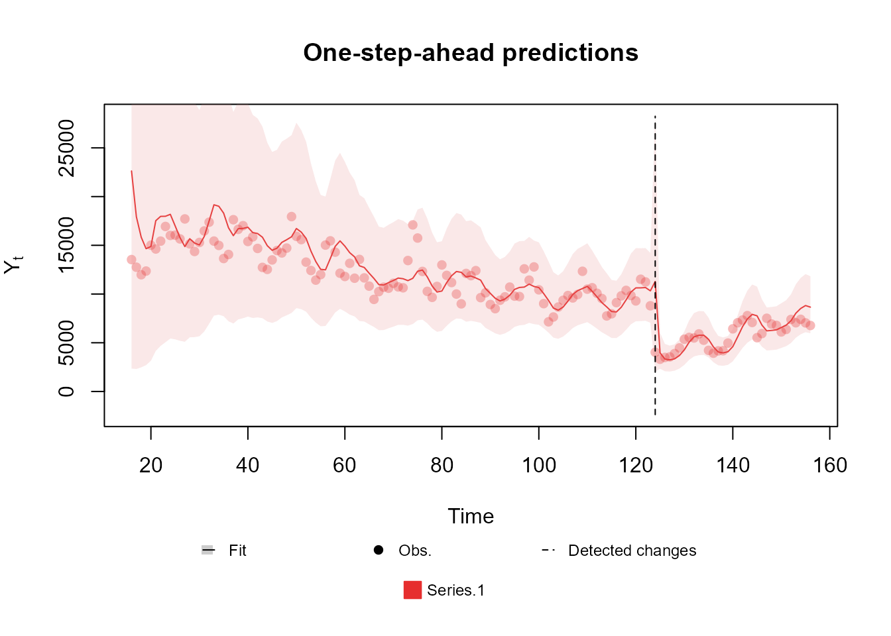
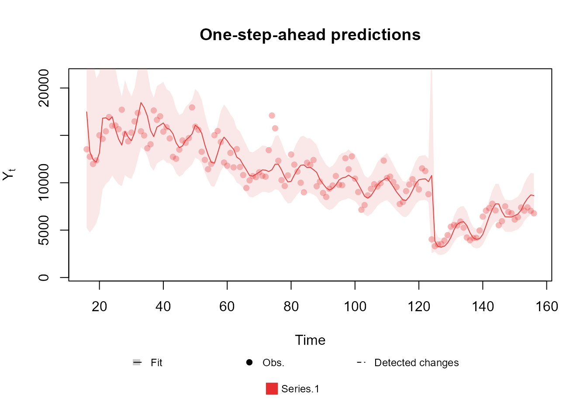
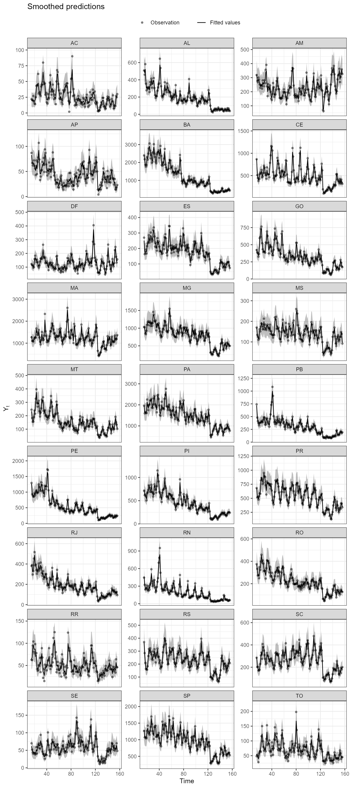
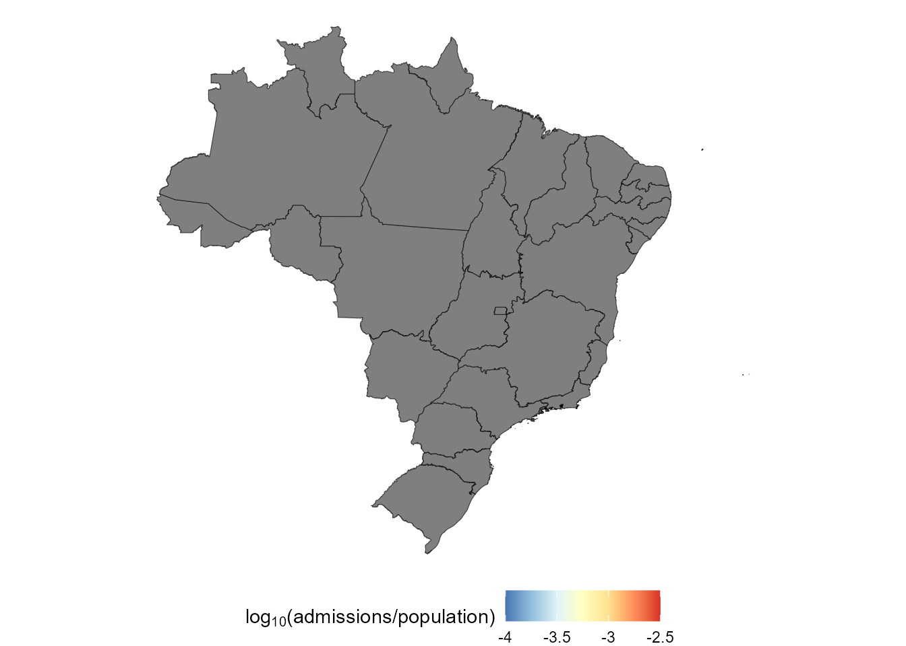
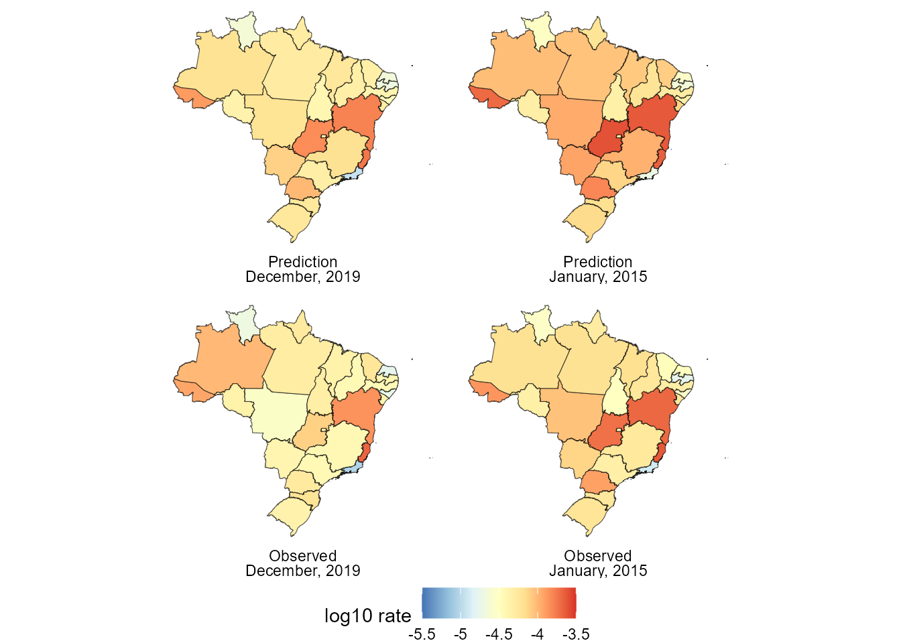

# Space-time model hospital admissions from gastroenteritis

## Table of contents

1.  [Introduction:](https://silvaneojunior.github.io/kDGLM/articles/intro.md)
    \>
    - [Introduction](https://silvaneojunior.github.io/kDGLM/articles/intro.html#introduction)
    - [Notation](https://silvaneojunior.github.io/kDGLM/articles/intro.html#notation)
2.  [Creating the model
    structure:](https://silvaneojunior.github.io/kDGLM/articles/structures.md)
    \>
    - [A structure for polynomial trend
      models](https://silvaneojunior.github.io/kDGLM/articles/structures.html#a-structure-for-polynomial-trend-models)
    - [A structure for dynamic regression
      models](https://silvaneojunior.github.io/kDGLM/articles/structures.html#a-structure-for-dynamic-regression-models)
    - [A structure for harmonic trend
      models](https://silvaneojunior.github.io/kDGLM/articles/structures.html#a-structure-for-harmonic-trend-models)
    - [A structure for autoregresive
      models](https://silvaneojunior.github.io/kDGLM/articles/structures.html#a-structure-for-autoregresive-models)
    - [A structure for overdispersed
      models](https://silvaneojunior.github.io/kDGLM/articles/structures.html#a-structure-for-overdispersed-models)
    - [Handling multiple structural
      blocks](https://silvaneojunior.github.io/kDGLM/articles/structures.html#handling-multiple-structural-blocks)
    - [Handling multiple linear
      predictors](https://silvaneojunior.github.io/kDGLM/articles/structures.html#handling-multiple-linear-predictors)
    - [Handling unknown components in the planning matrix
      $`F_t`$](https://silvaneojunior.github.io/kDGLM/articles/structures.html#handling-unknown-components-in-the-planning-matrix-f_t)
    - [Special
      priors](https://silvaneojunior.github.io/kDGLM/articles/structures.html#special-priors)
3.  [Creating the model
    outcome:](https://silvaneojunior.github.io/kDGLM/articles/outcomes.md)
    \>
    - [Normal
      case](https://silvaneojunior.github.io/kDGLM/articles/outcomes.html#normal-case)
    - [Poisson
      case](https://silvaneojunior.github.io/kDGLM/articles/outcomes.html#poisson-case)
    - [Gamma
      case](https://silvaneojunior.github.io/kDGLM/articles/outcomes.html#gamma-case)
    - [Multinomial
      case](https://silvaneojunior.github.io/kDGLM/articles/outcomes.html#multinomial-case)
    - [Handling multiple
      outcomes](https://silvaneojunior.github.io/kDGLM/articles/outcomes.html#handling-multiple-outcomes)
4.  [Fitting and analysing
    models:](https://silvaneojunior.github.io/kDGLM/articles/fitting.md)
    \>
    - [Filtering and
      smoothing](https://silvaneojunior.github.io/kDGLM/articles/fitting.html#filtering-and-smoothing)
    - [Extracting
      components](https://silvaneojunior.github.io/kDGLM/articles/fitting.html#extracting-components)
    - [Forecasting](https://silvaneojunior.github.io/kDGLM/articles/fitting.html#forecasting)
    - [Intervention and
      monitoring](https://silvaneojunior.github.io/kDGLM/articles/fitting.html#intervention-and-monitoring)
    - [Tools for sensibility
      analysis](https://silvaneojunior.github.io/kDGLM/articles/fitting.html#tools-for-sensibility-analysis)
    - [Sampling and hyper parameter
      estimation](https://silvaneojunior.github.io/kDGLM/articles/fitting.html#sampling-and-hyper-parameter-estimation)
5.  Advanced examples:\>
    - [Space-time model hospital admissions from
      gastroenteritis](https://silvaneojunior.github.io/kDGLM/articles/example1.md)

## Applied example: Space-time model for hospital admissions from gastroenteritis

In this example we model number of hospital admissions from
gastroenteritis in Brazil from 2010 to 2022 ([Ministry of Health,
Brazil, 2023](#ref-datasus_data)). The **kDGLM** package provides the
`gatroBR` dataset with the pertinent data for our models, which
includes:

- UF: The abbreviated state name.
- Date: The date of the observation. Note that the day is only a
  placeholder, as we are dealing with monthly reports.
- Admissions: The number hospital admissions that were reported in that
  combination of state and date.
- Population: The estimated population in that combination of state and
  date (to be used as a offset).

Supplementary information can be found in the documentation (see
[`help(gastroBR)`](https://silvaneojunior.github.io/kDGLM/reference/gastroBR.md))).

## Initial model: Total hospital admissions

We start the analysis with a model for the total number of hospital
admissions over time in Brazil, i.e., a temporal model that does not
consider the hospital admissions on each state.


From the figure above we can see that there is a consistent trend of
(log) linear decay of the rate of hospital admissions over time, until
April of 2020, when there is an abrupt reduction of hospital admission
due to the pandemic of COVID-19 ([Ribeiro et al.,
2022](#ref-covid_reduc)), which is then followed by what seems to be a
return to the previous level, although more observations would be
necessary to be sure. We can also note that the data has a clear
seasonal pattern, with a period of $`12`$ months.

We begin with a very simply model. Let $`Y_t`$ be the total number of
hospital admissions on Brazil at time $`t`$. Assume that:

``` math

\begin{aligned}
Y_t|\eta_t &\sim Poisson(\eta_t)\\
\ln{\eta_t}&=\lambda_t=\theta_{1,t}\\
\theta_{1,t}&=\theta_{1,t-1}+\theta_{2,t-1}+\omega_{1,t}\\
\theta_{2,t}&=\theta_{2,t-1}+\omega_{2,t}.\\
\end{aligned}
```

First we define the model structure:

``` r
structure <- polynomial_block(
  rate = 1, order = 2, D = 0.95,
  name = "Trend"
)
```

Then we define the outcome:

``` r
outcome <- Poisson(
  lambda = "rate",
  data = data.year$Admissions,
  offset = data.year$Population
)
```

Then we fit the model:

``` r
fitted.model <- fit_model(structure, outcome)
```

Finally, we can see how our model performed with the and methods:

``` r
summary(fitted.model)
```

    Fitted DGLM with 1 outcomes.

    distributions:
        Series.1: Poisson

    ---
    No static coeficients.
    ---
    See the coef.fitted_dlm for the coeficients with temporal dynamic.

    One-step-ahead prediction
    Log-likelihood        : -23169.24
    Interval Score        :   50668.22695
    Mean Abs. Scaled Error:       1.37514
    ---

``` r
plot(fitted.model, plot.pkg = "base")
```



Clearly the model described above is too simple to describe the data. In
particular, it does not take into account any form of seasonal pattern.
Let us proceed then by assuming the following model:

``` math

\begin{aligned}
Y_t|\eta_t &\sim Poisson(\eta_t)\\
\ln{\eta_t}&=\lambda_t=\theta_{1,t}+\theta_{3,t}\\
\theta_{1,t}&=\theta_{1,t-1}+\theta_{2,t-1}+\omega_{1,t}\\
\theta_{2,t}&=\theta_{2,t-1}+\omega_{2,t},\\
\begin{bmatrix}\theta_{3,t}\\\theta_{4,t}\end{bmatrix}&=R\begin{bmatrix}\theta_{3,t}\\\theta_{4,t}\end{bmatrix}+\begin{bmatrix}\omega_{3,t}\\\omega_{4,t}\end{bmatrix}\\
R&=\begin{bmatrix}
\cos(\frac{2\pi}{12})  &\sin(\frac{2\pi}{12})\\
-\sin(\frac{2\pi}{12}) & \cos(\frac{2\pi}{12})\end{bmatrix}
\end{aligned}
```

Where $`R`$ is a rotation matrix with angle $`\frac{2\pi}{12}`$, such
that $`R^{12}`$ is equal to the identity matrix.

To define the structure of that model we can use the `harmonic_block`
function alongside the `polynomial_block` function:

``` r
structure <- polynomial_block(
  rate = 1, order = 2, D = c(0.95, 0.975),
  name = "Trend"
) +
  harmonic_block(
    rate = 1, period = 12, D = 0.98,
    name = "Season"
  )
```

Then we fit the model (using the previously defined outcome):

``` r
fitted.model <- fit_model(structure, outcome)
```

``` r
summary(fitted.model)
```

    Fitted DGLM with 1 outcomes.

    distributions:
        Series.1: Poisson

    ---
    No static coeficients.
    ---
    See the coef.fitted_dlm for the coeficients with temporal dynamic.

    One-step-ahead prediction
    Log-likelihood        : -17262.59
    Interval Score        :   40387.96454
    Mean Abs. Scaled Error:       0.71032
    ---

``` r
plot(fitted.model, plot.pkg = "base")
```



Notice that this change significantly improves all metrics provided by
the model summary, which indicates that we are going in the right
direction. We encourage the reader to test different orders for the
harmonic block.

The previous model could capture the mean behavior of the series
reasonably well. However, two deficiencies of that model standout:
first, the overconfidence in the predictions, evidenced by the
particularly thin credibility interval; nnd second, the difficulty the
model had to adapt to the pandemic period.

The first problem comes from the fact that we are using a Poisson model,
which implies that $`Var[Y_t|\eta_t]=\mathbb{E}[Y_t|\eta_t]`$, which
means that
$`Var[Y_t]=\mathbb{E}[Var[Y_t|\eta_t]]+Var[\mathbb{E}[Y_t|\eta_t]]=\mathbb{E}[\eta_t]+Var[\eta_t]`$.
For latter observations we expect $`Var[\eta_t]`$ to be relatively
small; as such, the variance of $`Y_t`$ should be very close to its mean
after a reasonable amount of observations. In this scenario, the
coefficient of variation, defined as
$`\frac{\sqrt{Var[Y_t]}}{\mathbb{E}[Y_t]}`$ goes to $`0`$ as
$`\mathbb{E}[Y_t]`$ grows, in particular, for data in the scale we are
working with in this particular problem, we would expect a very low
coefficient of variation if the Poisson model were adequate, but that is
not what we observe. This phenomena is called and is a well known
problem in literature . To solve it, we can include a block representing
a white noise that is added to the linear predictor at each time, but
does not affect previous or future observation, so as to capture the
overdipersion. In this case, we will assume the following model:

``` math

\begin{aligned}
Y_t|\eta_t &\sim Poisson(\eta_t)\\
\ln{\eta_t}&=\lambda_t=\theta_{1,t}+\theta_{3,t}+\epsilon_t\\
\theta_{1,t}&=\theta_{1,t-1}+\theta_{2,t-1}+\omega_{1,t}\\
\theta_{2,t}&=\theta_{2,t-1}+\omega_{2,t},\\
\begin{bmatrix}\theta_{3,t}\\\theta_{4,t}\end{bmatrix}&=R\begin{bmatrix}\theta_{3,t}\\\theta_{4,t}\end{bmatrix}+\begin{bmatrix}\omega_{3,t}\\\omega_{4,t}\end{bmatrix}\\
\epsilon_t & \sim \mathcal{N}(0,\sigma_t^2)
\end{aligned}
```

This structure can be defined using the function, alongside the
previously used functions:

``` r
structure <- polynomial_block(
  rate = 1, order = 2, D = c(0.95, 0.975),
  name = "Trend"
) +
  harmonic_block(
    rate = 1, period = 12, D = 0.98,
    name = "Season"
  ) +
  noise_block(rate = 1, name = "Noise")
```

For the second problem, that of slow adaptation after the start of the
pandemic. The ideal approach would be to make an intervention,
increasing the uncertainty about the latent states at the beginning of
the pandemic period and allowing our model to quickly adapt to the new
scenario (see [West and Harrison, 1997, Chapter 11](#ref-WestHarr-DLM)).
We recommend this approach when we already expect a change of behavior
in a certain time, even before looking at the data (which is exactly the
case). Still, for didactic purposes, we will first present how the
automated monitoring can also be used to solve this same problem. In
general, we recommend the automated monitoring approach when we do
**not** known if or **when** a change of behavior happened before
looking at the data, i.e., we do not known of any particular event that
we expect to impact our outcome.

Following what was presented in the Subsection [Intervention and
monitoring](https://silvaneojunior.github.io/kDGLM/articles/fitting.html#intervention-and-monitoring),
we can use the following code to fit our model:

``` r
structure <- polynomial_block(
  rate = 1, order = 2, D = c(0.95, 0.975),
  name = "Trend", monitoring = c(TRUE, TRUE)
) +
  harmonic_block(
    rate = 1, period = 12, D = 0.98,
    name = "Season"
  ) +
  noise_block(rate = 1, name = "Noise")
```

Notice that we set the `monitoring` of the `polynomial_block` to
`c(TRUE,TRUE)`. By default, the `polynomial_block` function only
activates the monitoring of its first component (the level), but, by the
visual analysis made at the beginning, it is clear that the pandemic
affected both the level and the slope of the average number of hospital
admissions, as such, we would like to monitor both parameters.

``` r
# To activate the automated monitoring it is enough to set the p.monit argument to a valid value
fitted.model <- fit_model(structure, outcome, p.monit = 0.05)
summary(fitted.model)
```

    Fitted DGLM with 1 outcomes.

    distributions:
        Series.1: Poisson

    ---
    No static coeficients.
    ---
    See the coef.fitted_dlm for the coeficients with temporal dynamic.

    One-step-ahead prediction
    Log-likelihood        : -1260.715
    Interval Score        :   12946.2270
    Mean Abs. Scaled Error:       0.7108
    ---

``` r
plot(fitted.model, plot.pkg = "base")
```



The summary presented above shows a massive improvement in the
comparison metrics with the new changes introduced. Moreover, we can see
that the automated monitoring detected the exact moment where the series
$`Y_t`$ changed behavior, which allowed the model to immediately adapt
to the pandemic period.

One aspect of the model that may bother the reader is the exceedingly
high uncertainty at the first observations. This behavior is duo to our
approach to the estimation of the variance of the white noise introduced
by the `noise_block` function (see [dos Santos et al.,
2024](#ref-ArtigoMultivar) and the associated documentation for
details), which can be a bit too sensitive to bad prior specification at
the initial steps. As such, we highly recommend the user to perform a
sensitivity analysis to choose the initial variance of the white noise:

``` r
structure <- polynomial_block(
  rate = 1, order = 2, D = c(0.95, 0.975),
  name = "Trend"
) +
  harmonic_block(
    rate = 1, period = 12, D = 0.98,
    name = "Season"
  ) +
  noise_block(rate = 1, R1 = "H", name = "Noise") # Setting the initial variance as a unknown parameter

structure <- structure |>
  intervention(time = 124, var.index = c(1:2), D = 0.005)

search.model <- fit_model(
  structure, outcome,
  H = seq.int(0, 0.04, l = 101),
  metric.cutoff = 0
)
fitted.model <- search.model$model
```

Notice that, this time around, we chose to make an intervention at the
beginning of the pandemic, instead of an automated approach. As
mentioned before, this approach is preferable in this scenario, since we
were aware that the pandemic would affect our outcome before even
looking at the data.

``` r
summary(fitted.model)
```

    Fitted DGLM with 1 outcomes.

    distributions:
        Series.1: Poisson

    ---
    No static coeficients.
    ---
    See the coef.fitted_dlm for the coeficients with temporal dynamic.

    One-step-ahead prediction
    Log-likelihood        : -1223.8
    Interval Score        :    7803.10638
    Mean Abs. Scaled Error:       0.60274
    ---

Again, the new changes improve the comparison metrics even further,
leading to the conclusion that our last model is the best among those
presented until now. We highly encourage the reader to run this example
and experiment with some of the options the **kDGLM** package offers,
but that were not explored, such as changing the discount factors used
in each block, the order of the blocks, adding/removing structural
components, etc..

``` r
plot(fitted.model, plot.pkg = "base")
```



As a last side note, the user may not like the approach of choosing a
specific value for the initial variance of the white noise introduced by
the `noise_block`. Indeed, one may wish to define a prior distribution
for this parameter and estimate it along with the others. While we will
not detail this approach for the sake of brevity (since it is not
directly supported), we would like to point out that we do offer tools
to facilitate this procedure:

``` r
search.result <- search.model$search.data[order(search.model$search.data$H), ]

H.vals <- search.result$H
log.prior <- dgamma(H.vals, 1, 1, log = TRUE)
log.like <- search.result$log.like
l.fx <- log.prior + log.like
pre.fx <- exp(l.fx - max(l.fx))
fx <- pre.fx / sum(pre.fx * (H.vals[2] - H.vals[1]))
plot(H.vals, fx,
  type = "l", xlab = "H", ylab = "Density",
  main = "Posterior density for the unknown hyperparameter H"
)
```



## Advanced model: Hospital admissions by state

For this model, we need the geographic information about Brazil, as
such, we will use some auxiliary packages, namely **geodata**,
**terra**, **tidyverse**, **sf** and **spdep**, although the **kDGLM**
package does not depend on them:

``` r
require(geodata)
require(terra)
require(tidyverse)
require(sf)
require(spdep)

geodata_path(tempdir())

br.base <- gadm(country = "BRA", level = 1) |>
  st_as_sf() |>
  mutate(abbrev_state = str_split_i(HASC_1, ".", 2))

plot.data <- br.base |>
  left_join(
    gastroBR |>
      filter(format(Date, "%Y") == "2019") |>
      select(UF, Population, Admissions) |>
      group_by(UF) |>
      summarize(
        Population = max(Population),
        Admissions = sum(Admissions)
      ) |>
      rename(abbrev_state = UF),
    by = "abbrev_state"
  )

(ggplot() +
  geom_sf(data = plot.data, aes(fill = log10(Admissions / Population))) +
  scale_fill_distiller(expression(log[10] * "(admissions/population)"),
    limits = c(-4, -2.5),
    palette = "RdYlBu",
    labels = ~ round(., 2)
  ) +
  theme_void() +
  theme(legend.position = "bottom"))
```



Now we proceed to fitting the model itself. Let $`Y_{it}`$ be the number
of hospital admissions by gastroenteritis at time $`t`$ on region $`i`$,
we will assume the following model:

``` math

\begin{aligned}
Y_{it}|\eta_{it} &\sim Poisson(\eta_{it})\\
\ln\{\eta_{it}\}&= \lambda_{it}=\theta_{1,t}+u_{i,t}+S_{i,t}+\epsilon_{i,t},\\
\theta_{1,t}&= \theta_{1,t-1}+\theta_{2,t-1}+\omega_{1,t},\\
\theta_{2,t}&= \theta_{2,t-1}+\omega_{2,t},\\
\begin{bmatrix}u_{i,t}\\ v_{i,t}\end{bmatrix} &= R \begin{bmatrix}u_{i,t-1}\\ v_{i,t-1}\end{bmatrix} + \begin{bmatrix} \omega^{u}_{i,t}\\ \omega^{u}_{i,t}\end{bmatrix},\\
\epsilon_t & \sim \mathcal{N}(0,\sigma_t^2),\\
S_{1,1},...,S_{r,1} & \sim CAR(\tau), 
\end{aligned}
```
where $`r=27`$ is the number of areas within our dataset.

Currently, the **kDGLM** package does not offer support for sequential
estimation of $`\tau`$, the parameter associated with the CAR prior. A
study is being developed to address this limitation. For now, we opt to
conduct a sensitivity analysis to determine an optimal value for $`tau`$
using the tools presented in Subsection [Tools for sensitivity
analysis](https://silvaneojunior.github.io/kDGLM/articles/fitting.html#tools-for-sensitivity-analysis).
The optimal value found was $`\tau=0.005`$.

Alternatively, if real-time inference is not a priority for the analyst,
a complete posterior for $`\tau`$ can be obtained by adapting the code
from Subsection [Sampling and hyper parameter
estimation](https://silvaneojunior.github.io/kDGLM/articles/fitting.html#sampling-and-hyper-parameter-estimation),
without incurring a high computational cost.

Notice that we are assuming a very similar model to that which was used
in the initial_model, but here we have a common effect (or a global
effect) $`\theta_{1,t}`$ that equally affects all regions, and a local
effect $`S_{i,t}`$ that only affects region $`i`$ and evolves smoothly
though time. Here we chose a vague CAR prior ([Banerjee et al.,
2014](#ref-banerjee2014hierarchical); [Schmidt and Nobre,
2018](#ref-AlexCar)) for $`S_{i,t}`$.

The proposed model can be fitted using the following code:

``` r
adj.matrix <- br.base |>
  poly2nb() |>
  nb2mat(style = "B")

CAR.structure <- polynomial_block(rate = 1, D = 0.98, name = "CAR") |>
  block_mult(27) |>
  block_rename(levels(gastroBR$UF)) |>
  CAR_prior(scale = "Scale", rho = 1, adj.matrix = adj.matrix) |>
  zero_sum_prior()

shared.structure <- polynomial_block(
  RO = 1, AC = 1, AM = 1, RR = 1, PA = 1, AP = 1,
  TO = 1, MA = 1, PI = 1, CE = 1, RN = 1, PB = 1,
  PE = 1, AL = 1, SE = 1, BA = 1, MG = 1, ES = 1,
  RJ = 1, SP = 1, PR = 1, SC = 1, RS = 1, MS = 1,
  MT = 1, GO = 1, DF = 1,
  order = 2, D = c(0.95, 0.95),
  name = "Common"
) |>
  intervention(time = 124, var.index = c(1:2), D = 0.005)

base.structure <- (harmonic_block(rate = 1, order = 1, period = 12, D = 0.98, name = "Season") +
  noise_block(rate = 1, R1 = 0.007, name = "Noise")) |>
  block_mult(27) |>
  block_rename(levels(gastroBR$UF))

inputs <- list(shared.structure, CAR.structure, base.structure)
for (uf in levels(gastroBR$UF)) {
  reg.data <- gastroBR |> filter(UF == uf)
  inputs[[uf]] <- Poisson(lambda = uf, data = reg.data$Admissions, offset = reg.data$Population)
}
# inputs$Scale <- 10**seq.int(-5, 1, l = 21)
inputs$Scale <- 0.3162278
model.search <- do.call(fit_model, inputs)
# fitted.model <- model.search$model
fitted.model <- model.search
```

``` r
plot(fitted.model)
```

``` r
(plot(fitted.model, outcomes = c("MG", "SP", "ES", "RJ", "CE", "BA", "RS", "SC", "AM", "AC"), lag = 1, plot.pkg = "ggplot2") +
  scale_color_manual("", values = rep("black", 10)) +
  scale_fill_manual("", values = rep("black", 10)) +
  geom_vline(xintercept = 124, linetype = "dashed") +
  facet_wrap(~Serie, ncol = 2, scale = "free_y") +
  coord_cartesian(ylim = c(NA, NA)) +
  guides(color = "none", fill = "none") +
  theme(legend.position = "top"))
```

    
[1m
[22mScale for 
[32mcolour
[39m is already present.
    Adding another scale for 
[32mcolour
[39m, which will replace the existing scale.
    
[1m
[22mScale for 
[32mfill
[39m is already present.
    Adding another scale for 
[32mfill
[39m, which will replace the existing scale.
    
[1m
[22mCoordinate system already present.
    
[36mℹ
[39m Adding new coordinate system, which will replace the existing one.


The time series of hospital admissions by gastroenteritis of some
Brazilian states from 2010 to 2022. Notice that the proposed model can
capture the general behavior of all series, while simultaneously
capturing the dependence between regions through the shared component
$`\theta_{1,t}`$ and the local effects $`S_i`$.

``` r
smoothed.values <- coef(fitted.model)
plot.data <- data.frame()
labels <- list(
  "2010-01-01" = "(a) January, 2010",
  "2020-03-01" = "(b) March, 2020",
  "2020-04-01" = "(c) April, 2020",
  "2022-12-01" = "(d) December, 2022"
)
for (date in c("2010-01-01", "2020-03-01", "2020-04-01", "2022-12-01")) {
  index <- min(which(gastroBR$Date == date))
  plot.data <- rbind(
    plot.data,
    cbind(
      Date = labels[[date]],
      Effect = smoothed.values$lambda.mean[order(order(levels(reg.data$UF))), index] / log(10),
      br.base
    )
  )
}

(ggplot() +
  geom_sf(data = plot.data, aes(fill = Effect)) +
  facet_wrap(~Date, strip.position = "bottom") +
  scale_fill_distiller("$\\log_{10}$ rate",
    limits = c(-6, -3),
    palette = "RdYlBu",
    labels = ~ round(., 2)
  ) +
  theme_void() +
  theme(legend.position = "bottom"))
```

![The \$\log\_{10}\$ hospital admissions rate by gastroenteritis in
Brazilian states at 4 key moments: (a) January of 2010, were our data
begins; (b) March of 2020, the month were the first case of COVID-19 was
registered in Brazil and before public response; (c) April of 2020, the
first month of the pandemic period; and (d) December of 2022, the end of
the period of study and roughly 2 years after the beginning of the
pandemic. Notice that from (a) to (b) 10 years had passed and we see
that a steady and smoothly yearly reductions of hospital admissions led
to a significantly reduction of the rate of hospital. In contrast, from
(b) to (c), only 1 month had passed, but we see a reduction that,
proportionally, is event greater than from (a) to (b). Lastly, from (c)
to (d), after roughly 2 years, the rate of hospital admissions seems to
be going back to what was seen in
(c).](example1_files/figure-html/unnamed-chunk-25-1.png)

The $`\log_{10}`$ hospital admissions rate by gastroenteritis in
Brazilian states at 4 key moments: (a) January of 2010, were our data
begins; (b) March of 2020, the month were the first case of COVID-19 was
registered in Brazil and before public response; (c) April of 2020, the
first month of the pandemic period; and (d) December of 2022, the end of
the period of study and roughly 2 years after the beginning of the
pandemic. Notice that from (a) to (b) 10 years had passed and we see
that a steady and smoothly yearly reductions of hospital admissions led
to a significantly reduction of the rate of hospital. In contrast, from
(b) to (c), only 1 month had passed, but we see a reduction that,
proportionally, is event greater than from (a) to (b). Lastly, from (c)
to (d), after roughly 2 years, the rate of hospital admissions seems to
be going back to what was seen in (c).

``` r
labels <- list(
  "2015-01-01" = "January, 2015",
  "2019-12-01" = "December, 2019"
)
plot.data <- data.frame()
for (date in c("2015-01-01", "2019-12-01")) {
  index <- min(which(gastroBR$Date == date))

  forecast.vals <- coef(fitted.model, lag = 3, t.eval = index, eval.pred = TRUE)

  mean.pred <- forecast.vals$data$Prediction
  reg.data <- gastroBR %>%
    filter(Date == date) %>%
    mutate(Tx = log10(Admissions / Population))

  plot.data <- rbind(
    plot.data,
    cbind(
      Date = labels[[date]],
      Effect = log10(mean.pred) - log10(reg.data$Population),
      br.base,
      Label = "Prediction"
    )
  )
  plot.data <- rbind(
    plot.data,
    cbind(
      Date = labels[[date]],
      Effect = reg.data$Tx, br.base,
      Label = "Observed"
    )
  )
}
plot.data$Label <- factor(plot.data$Label, levels = unique(plot.data$Label))

(ggplot() +
  geom_sf(data = plot.data, aes(fill = Effect)) +
  facet_wrap(Label ~ Date, strip.position = "bottom") +
  scale_fill_distiller("log10 rate",
    limits = c(-5.5, -3.5),
    palette = "RdYlBu",
    labels = ~ round(., 2)
  ) +
  theme_void() +
  theme(legend.position = "bottom"))
```

 Since there are
$`27`$ regions, with $`156`$ observations each, it is not reasonably to
show how our model performed for every combination of date and location.
We will limit ourselves to show some regions at all times and all
regions at some times The reader may use the code provided in this
document or in the vignette to fit this model and do a thoroughly
examination of the results. Moreover, here we focus only in the usage of
the **kDGLM** package and not in the epidemiological aspect of the
results.

Finally, about the computational cost, the initial model (that for the
total number of hospital admissions over time) took about $`0.11s`$ to
fit and the advanced model took $`4.24s`$, which is within the expected
range, since the final model has $`27`$ outcomes and $`110`$ latent
states that, when we consider that they all had temporal dynamic, yields
$`17.160`$ parameters, from which the joint distribution is obtained.

## References

Banerjee, S., Carlin, B. P., and Gelfand, A. E. (2014). *Hierarchical
modeling and analysis for spatial data*. Chapman; Hall/CRC.

dos Santos, S. V., Junior, Alves, M. B., and Migon, H. S. (2024). An
efficient sequential approach for joint modelling of multiple time
series.

Ministry of Health, Brazil. (2023). DATASUS - department of informatics
of the unified health system. <http://datasus.saude.gov.br>.

Ribeiro, E. G., Pinheiro, P. C., Nascimento, B. R., Cacique, J. P. P.,
Teixeira, R. A., Nascimento, J. de S., … Malta, D. C. (2022). [Impact of
the COVID-19 pandemic on hospital admissions for cardiovascular diseases
in a large brazilian urban
center](https://doi.org/10.1590/0037-8682-0264-2021). *Revista Da
Sociedade Brasileira de Medicina Tropical*, *55*, e0264–2021.

Schmidt, A. M., and Nobre, W. S. (2018). [Conditional autoregressive
(CAR) model](https://doi.org/10.1002/9781118445112.stat08048). In *Wiley
StatsRef: Statistics reference online*, pages 1–11. John Wiley & Sons,
Ltd.

West, M., and Harrison, J. (1997). *Bayesian forecasting and dynamic
models (springer series in statistics)*. Hardcover; Springer-Verlag.
